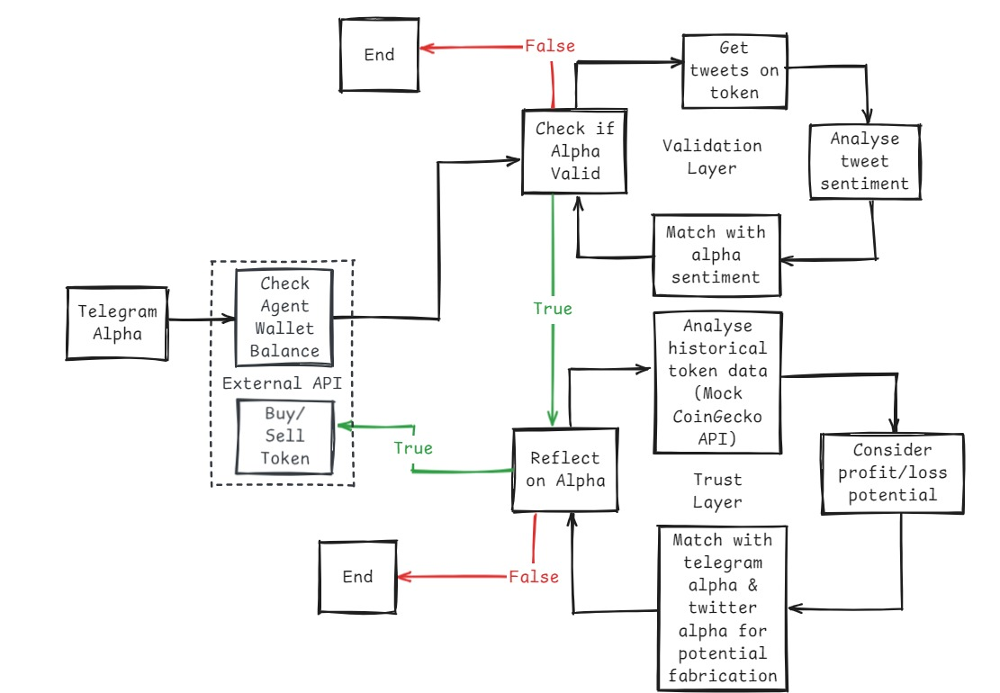

<div align="center">
  
  <h1>AlphaScan</h1>
  <p><strong>DeFAI agent on 0G Chain — AI-powered Telegram signal monitoring with autonomous on-chain trading</strong></p>

  
  
  
  
</div>

---

AlphaScan monitors Telegram groups for cryptocurrency signals, validates them through a multi-layer AI pipeline, and executes trades autonomously on the 0G blockchain — with a full on-chain audit trail.


## How It Works

Every signal goes through five stages before a trade is placed:

1. **Collect** — Monitors user-selected Telegram groups and forum topics in real time via persistent Telegram client sessions
2. **Extract** — Every 10 messages, an LLM (via 0G Compute Router) identifies token mentions and determines market sentiment
3. **Validate** — Cross-references sentiment against independently generated social signals to filter false positives
4. **Trust** — Checks historical price trend direction and calculates PnL potential; rejects low-confidence signals
5. **Trade** — Executes a buy or sell on 0G chain using the user's linked agent wallet; logs every decision with full input/output

## Features

- **Real-time Telegram monitoring** — group and forum-topic watching via Telethon user sessions
- **Multi-layer AI pipeline** — extraction → validation → trust scoring, each backed by LLM inference on 0G Compute
- **Autonomous trading** — buys/sells DEAL and ALT tokens on 0G Galileo based on signal confidence
- **Full audit trail** — every pipeline decision logged to MongoDB with inputs and outputs, browsable in the UI
- **Secure agent wallet** — private key encrypted server-side (Fernet) and never stored on-chain or in calldata
- **On-chain linking** — MetaMask wallet cryptographically linked to agent wallet address via `Linking.sol`

## Architecture

```
┌─────────────────┐     ┌──────────────────────┐     ┌──────────────────┐
│  op-frontend/   │────▶│    tg-backend/       │────▶│  0G Blockchain   │
│  Next.js 15     │     │  FastAPI + Telethon  │     │  chain ID 16602  │
│  wagmi + viem   │     │  web3.py + MongoDB   │     │  Linking.sol     │
│  RainbowKit     │     │  0G Compute Router   │     │  DEAL / ALT      │
└─────────────────┘     └──────────────────────┘     └──────────────────┘
```

| Layer | Technology |
|---|---|
| Frontend | Next.js 15, React 19, Tailwind CSS, wagmi v2, RainbowKit |
| Backend | Python, FastAPI, Telethon, Motor, web3.py |
| AI inference | 0G Compute Router (OpenAI-compatible API) |
| Smart contracts | Solidity 0.8.28, Hardhat, 0G Galileo (chain ID 16602) |
| Database | MongoDB |

## Project Structure

```
.
├── op-frontend/            # Next.js web app
│   ├── app/
│   │   ├── dashboard/      # Main dashboard with market overview and AI insights
│   │   ├── wallet/         # Agent wallet creation and on-chain linking
│   │   ├── agent-actions/  # Trade history and pipeline decision log
│   │   └── select-group/   # Telegram group picker
│   └── lib/wallet.ts       # Agent wallet creation and 0G token transactions
│
├── tg-backend/             # Python backend
│   ├── tele.py             # FastAPI app, Telegram clients, signal pipeline
│   └── web3util.py         # 0G chain trade execution (buy, sell, balances)
│
└── 0g-map-mock/            # Smart contracts (Hardhat)
    ├── contracts/
    │   ├── Linking.sol     # Maps MetaMask wallet → agent wallet address
    │   ├── MockToken.sol   # DEAL token (ERC20)
    │   └── MockToken2.sol  # ALT token (ERC20)
    └── scripts/deploy.ts   # Deploy all three contracts and print addresses
```

## Getting Started

### Prerequisites

- Node.js 18+
- Python 3.8+
- MongoDB database ([Atlas free tier](https://www.mongodb.com/atlas) works fine)
- Telegram API credentials — create an app at [my.telegram.org](https://my.telegram.org)
- 0G API key — from [pc.testnet.0g.ai](https://pc.testnet.0g.ai) (connect wallet → deposit 0G → create key)
- Wallet with 0G testnet tokens — [faucet.0g.ai](https://faucet.0g.ai)

### 1. Deploy contracts

```bash
cd 0g-map-mock
cp .env.example .env
# Set ACCOUNT_PRIVATE_KEY to the deployer wallet private key
npx hardhat run scripts/deploy.ts --network 0g-testnet
```

The script prints three contract addresses. You'll need them in the next steps.

### 2. Configure the backend

```bash
cd tg-backend
pip install -r requirements.txt
cp .env.example .env
```

Fill in `.env`:

| Variable | Description |
|---|---|
| `MONGO_URI` | MongoDB connection string |
| `ENCRYPTION_KEY` | Fernet key — generate one with `python generate.py` |
| `API_ID` / `API_HASH` | Telegram API credentials from my.telegram.org |
| `OG_API_KEY` | 0G Compute Router key |
| `OG_MODEL` | LLM model name (e.g. `qwen/qwen-2.5-7b-instruct`) |
| `OG_ROUTER_URL` | 0G Compute Router base URL |
| `RPC_URL` | 0G RPC endpoint (e.g. `https://evmrpc-testnet.0g.ai`) |
| `LINKING_CONTRACT_ADDRESS` | From deploy step |
| `DEAL_TOKEN_ADDRESS` | From deploy step |
| `ALT_TOKEN_ADDRESS` | From deploy step |

### 3. Configure the frontend

```bash
cd op-frontend
npm install
```

Create `.env.local`:

```bash
NEXT_PUBLIC_BACKEND_URL=http://localhost:8000
```

Update `contractAddress` in `op-frontend/app/abi.ts` with the `Linking.sol` address from the deploy step.

### 4. Run

Start the backend:

```bash
cd tg-backend
uvicorn tele:app --host 0.0.0.0 --port 8000 --reload
```

Start the frontend:

```bash
cd op-frontend
npm run dev
```

Open [http://localhost:3000](http://localhost:3000), connect MetaMask on the 0G Galileo Testnet, log in with your Telegram account, and select the groups to watch.

> [!NOTE]
> The backend reconnects existing Telegram sessions on startup. Allow a few seconds for listeners to initialize before expecting signals to process.

> [!IMPORTANT]
> The `ENCRYPTION_KEY` must remain constant across restarts. If it changes, all stored Telegram sessions and agent keys become unreadable and users will need to re-authenticate.

## API Reference

| Method | Path | Description |
|---|---|---|
| `POST` | `/init` | Start Telegram OTP flow for a user |
| `POST` | `/verify` | Confirm OTP, store encrypted Telegram session |
| `POST` | `/store-agent-key` | Register encrypted agent wallet key (EIP-191 verified) |
| `POST` | `/watch-group` | Start watching a Telegram group or forum topic |
| `DELETE` | `/unwatch-group` | Stop watching a group |
| `GET` | `/watched-groups/{user_id}` | List active watchers |
| `GET` | `/user-groups/{user_id}` | List all user's Telegram groups and channels |
| `GET` | `/get-logs/{user_id}` | Full agent decision log |
| `GET` | `/get-token-history/{user_id}` | Traded tokens and current balances |

## Security Model

Agent wallet private keys are never stored on-chain or sent in transaction calldata. The linking flow works as follows:

1. The frontend generates an agent wallet and prompts the user to sign an EIP-191 message with MetaMask
2. The backend verifies the signature — ensuring only the MetaMask wallet owner can register a key
3. The agent private key is encrypted with Fernet and stored in MongoDB (same scheme used for Telegram sessions)
4. Only the agent wallet's public address is written to `Linking.sol`

All sensitive values in MongoDB are encrypted at rest using `ENCRYPTION_KEY`. Keep this value secret and back it up.

## 0G Network Reference

| | Testnet | Mainnet |
|---|---|---|
| Chain ID | 16602 | 16661 |
| RPC | `evmrpc-testnet.0g.ai` | `evmrpc.0g.ai` |
| Explorer | [chainscan-galileo.0g.ai](https://chainscan-galileo.0g.ai) | [chainscan.0g.ai](https://chainscan.0g.ai) |
| Compute Router | `router-api-testnet.integratenetwork.work/v1` | `router-api.0g.ai/v1` |
| Faucet | [faucet.0g.ai](https://faucet.0g.ai) | — |
| Compute Portal | [pc.testnet.0g.ai](https://pc.testnet.0g.ai) | [pc.0g.ai](https://pc.0g.ai) |
